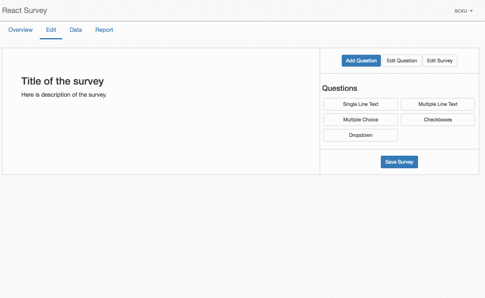
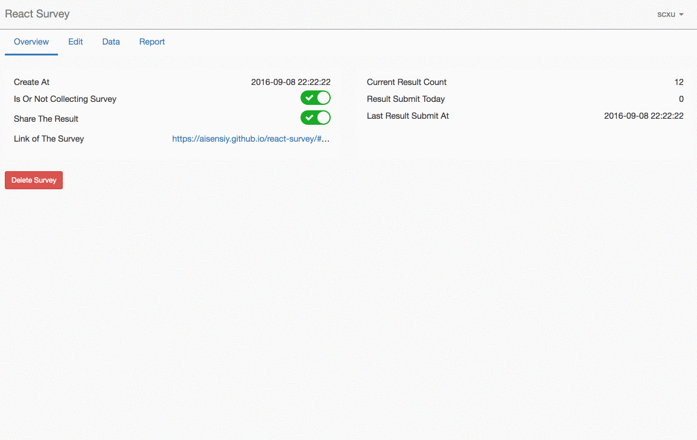
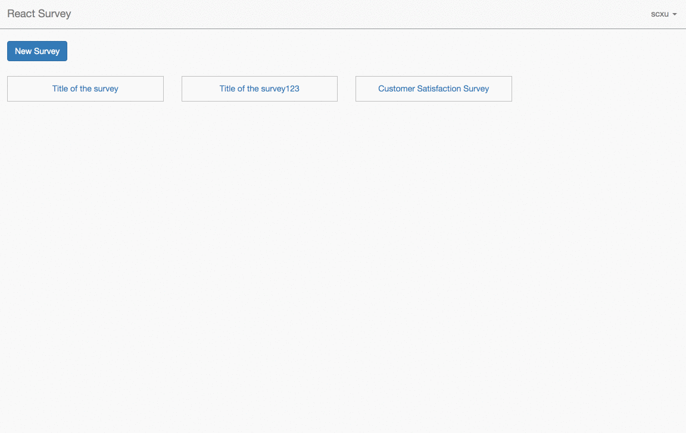
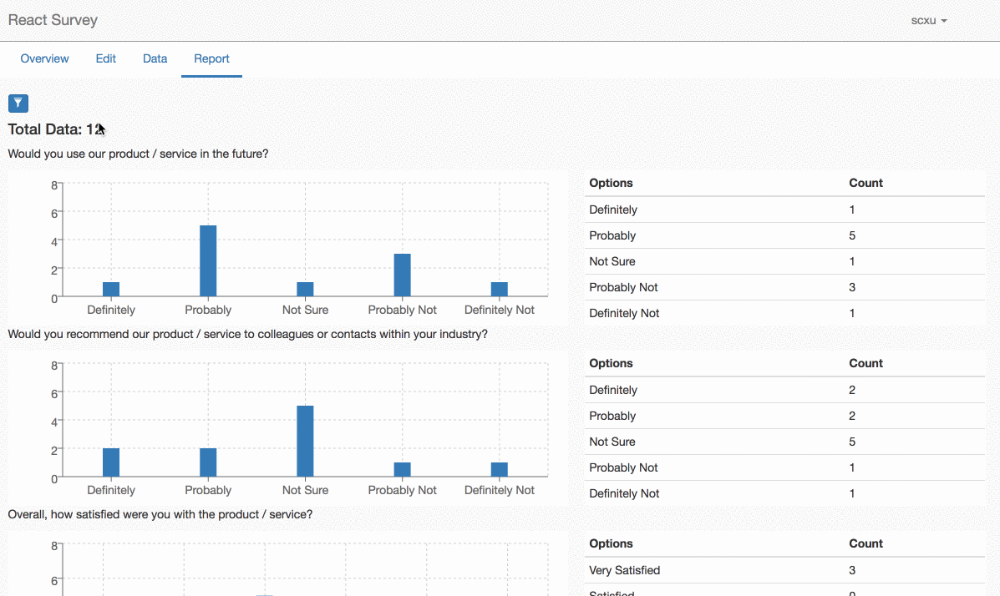

# React Survey

Right now, there are many tutorial react apps to show how to make it work with redux and react, but these apps do not help to learn how to handle a real project. Survey or questionaier is a well-known problem. React Survey is a project show how to use redux and react build a more complicated web application.

See live demo [here](https://aisensiy.github.io/react-survey)

## Features

### Survey editor



### Survey collect



### Data view



### Report process



## Run

This is just a front end part of the whole application. To make the application work, the backend part is also necessary.

### For Frontend

```sh
npm install
export REACT_APP_ENDPOINT=http://localhost:5000/api
npm start
```
Or you can deploy it on Netlify.
1. Login to Netlify and connect with your github.
2. Env settings.
```
NPM_CONFIG_PRODUCTION:false
REACT_APP_ENDPOINT: $YOUR_BACKEND_URL
```
3. And deploy the branch.

### Cross-Origin Resource Sharing

CORS is needed to connect localhost frontend and backend.
You can use Allow-Control-Allow-Origin as a chrome plugin.

### For Backend

Get the backend part from [here](https://github.com/aisensiy/rails-survey-backend). This is a rails5 application. You need install ruby on your machine. 

The fatest way to deploy the backend is to use [Heroku](https://www.heroku.com/).
